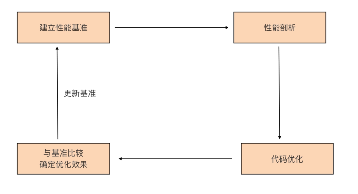
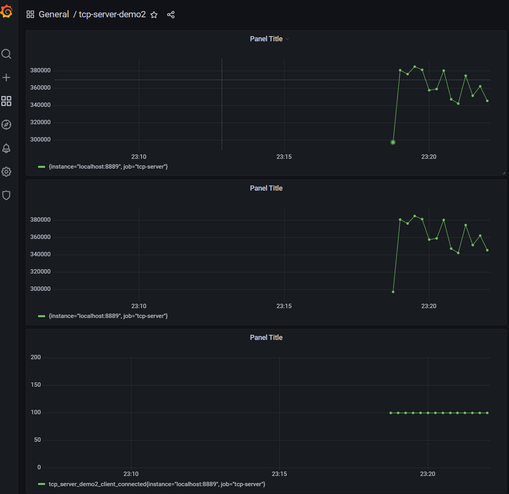
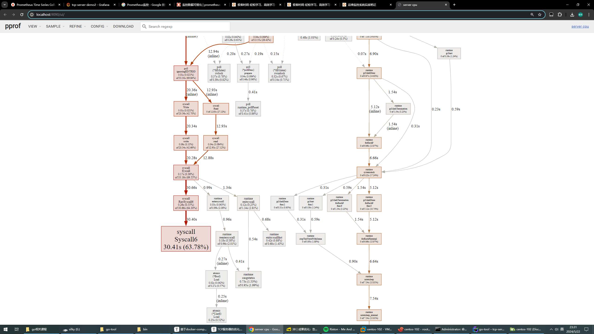

# 1.优化一个服务器的思路。



首先我们要建立性能基准。要想对程序实施优化，我们首先要有一个初始“参照物”，这样我们才能在执行优化措施后，检验优化措施是否有效，所以这是优化循环的第一步。

第二步是性能剖析。要想优化程序，我们首先要找到可能影响程序性能的“瓶颈点”，这一步的任务，就是通过各种工具和方法找到这些“瓶颈点”。

第三步是代码优化。我们要针对上一步找到的“瓶颈点”进行分析，找出它们成为瓶颈的原因，并有针对性地实施优化。

第四步是与基准比较，确定优化效果。这一步，我们会采集优化后的程序的性能数据，与第一步的性能基准进行比较，看执行上述的优化措施后，是否提升了程序的性能。

接下来我们就按照这四个步骤来对这个服务器进行优化。

# 2. 建立性能基准

这里我们主要是通过服务器的吞吐量来观察服务器的性能是否得到了提升。

具体学习这些监控工具主要看这个链接https://yunlzheng.gitbook.io/prometheus-book/parti-prometheus-ji-chu/quickstart。基本方案就是Prometheus+Grafana。

## 2.1 在服务端埋入度量数据采集点

我们服务器的数据就是看吞吐量。所以具体我们就看三个指标。

- 当前已连接的客户端数量（client_connected）

- 每秒接收消息请求的数量（req_recv_rate）
- 每秒发送消息响应的数量（rsp_send_rate）

接着就是埋点操作，我们需要在服务器端的代码进行埋点。我们新建一个工程tcp-server-demo2，首先是创建新的 metrics 包负责定义度量数据项，代码如下。

```go
package metrics

import (
	"fmt"
	"net/http"

	"github.com/prometheus/client_golang/prometheus"
	"github.com/prometheus/client_golang/prometheus/promhttp"
)

const metricsHTTPPort = 8889 //for prometheus to connect

var (
	ClientConnected prometheus.Gauge
	ReqRecvTotal    prometheus.Counter
	RspSendTotal    prometheus.Counter
)

func init() {
	ReqRecvTotal = prometheus.NewCounter(prometheus.CounterOpts{
		Name: "tcp_server_demo2_req_recv_total",
	})
	RspSendTotal = prometheus.NewCounter(prometheus.CounterOpts{
		Name: "tcp_server_demo2_rsp_send_total",
	})

	ClientConnected = prometheus.NewGauge(prometheus.GaugeOpts{
		Name: "tcp_server_demo2_client_connected",
	})

	prometheus.MustRegister(ReqRecvTotal, RspSendTotal, ClientConnected)

	// start the metrics server
	metricsServer := &http.Server{
		Addr: fmt.Sprintf(":%d", metricsHTTPPort),
	}

	mu := http.NewServeMux()
	mu.Handle("/metrics", promhttp.Handler())
	metricsServer.Handler = mu

	go func() {
		err := metricsServer.ListenAndServe()
		if err != nil {
			fmt.Println("prometheus-exporter http server start failed:", err)
		}
	}()
	fmt.Println("metrics server start ok(*:8889)")
}
```

接着就是在server下埋入这些监控点。

```go
package main

import (
	"fmt"
	"net"

	"github.com/bigwhite/tcp-server-demo2/frame"
	"github.com/bigwhite/tcp-server-demo2/metrics"
	"github.com/bigwhite/tcp-server-demo2/packet"
)

func handlePacket(framePayload []byte) (ackFramePayload []byte, err error) {
	var p packet.Packet
	p, err = packet.Decode(framePayload)
	if err != nil {
		fmt.Println("handleConn: packet decode error:", err)
		return
	}

	switch p.(type) {
	case *packet.Submit:
		submit := p.(*packet.Submit)
		//fmt.Printf("recv submit: id = %s, payload=%s\n", submit.ID, string(submit.Payload))
		submitAck := &packet.SubmitAck{
			ID:     submit.ID,
			Result: 0,
		}
		ackFramePayload, err = packet.Encode(submitAck)
		if err != nil {
			fmt.Println("handleConn: packet encode error:", err)
			return nil, err
		}
		return ackFramePayload, nil
	default:
		return nil, fmt.Errorf("unknown packet type")
	}
}

func handleConn(c net.Conn) {
	metrics.ClientConnected.Inc()
	defer func() {
		metrics.ClientConnected.Dec()
		c.Close()
	}()
	frameCodec := frame.NewMyFrameCodec()

	for {
		// read from the connection

		// decode the frame to get the payload
		// the payload is undecoded packet
		framePayload, err := frameCodec.Decode(c)
		if err != nil {
			fmt.Println("handleConn: frame decode error:", err)
			return
		}
		metrics.ReqRecvTotal.Add(1)

		// do something with the packet
		ackFramePayload, err := handlePacket(framePayload)
		if err != nil {
			fmt.Println("handleConn: handle packet error:", err)
			return
		}

		// write ack frame to the connection
		err = frameCodec.Encode(c, ackFramePayload)
		if err != nil {
			fmt.Println("handleConn: frame encode error:", err)
			return
		}
		metrics.RspSendTotal.Add(1)
	}
}

func main() {
	l, err := net.Listen("tcp", ":8888")
	if err != nil {
		fmt.Println("listen error:", err)
		return
	}

	fmt.Println("server start ok(on *:8888)")

	for {
		c, err := l.Accept()
		if err != nil {
			fmt.Println("accept error:", err)
			break
		}
		// start a new goroutine to handle
		// the new connection.
		go handleConn(c)
	}
}
```

接着就是在 Grafana创建三个panel来监控对应的数据监控点。这个具体过程大家可以搜搜教程。我们对于每秒接收和发送的数据量是看15秒内的平均值，这个地方需要注意一下，具体设置的时候需要通过rate函数来设置，我们来看看跑起来的效果。



现在的虚拟机的配置是4核8G，吞吐量大概是34W/S左右。


# 3.性能剖析

我们虽然现在建立了性能基准，但是目前来说，我们还不知道程序的问题出在哪里，所以我们需要看看程序最长调用时间大概出现在什么地方。这里我们使用的工具是pprof 。pprof的使用非常简单。你只需要在server中引入`net/http/pprof`， 并开启一个goroutine来采集程序运行时数据。此处代码在tcp-server-demo2-with-pprof 中。

```go
// tcp-server-demo2-with-pprof/cmd/server/main.go
import (
	... ...
	"net/http"
	_ "net/http/pprof"
	... ...
)
... ...
func main() {
	go func() {
		http.ListenAndServe(":6060", nil)
	}()
... ...
}
```

然后你就可以在自己开发机下运行该命令。

```shell
// 192.168.150.102为服务端的主机地址
$go tool pprof -http=:9090 http://192.168.150.102:6060/debug/pprof/profile
Fetching profile over HTTP from http://192.168.150.102:6060/debug/pprof/profile
Saved profile in C:\Users\silky\pprof\pprof.server.samples.cpu.004.pb.gz
Serving web UI on http://localhost:9090
listen tcp 127.0.0.1:9090: bind: Only one usage of each socket address (protocol/network address/port) is normally permitted.
```

go tool pprof 命令默认会从 http://192.168.150.102:6060/debug/pprof/profile 服务上，采集 CPU类型的性能剖析数据，然后打开本地浏览器。然后你打开

http://localhost:9090，就会得到一个这样的界面。



我们可以看到syscall的调用太多了，接着往上看，基本就是write函数和read函数引起。我们再具体分析一下代码，我们每次网络I/O都是直接从Conn中读取，着我们似乎可以加一个缓存来优化。所以就产生了第三套方案tcp-server-demo3 。最主要的修改都集中在cmd/server/main.go#handleConn，我们来看看代码。

```go
func handleConn(c net.Conn) {
	metrics.ClientConnected.Inc()
	defer func() {
		metrics.ClientConnected.Dec()
		c.Close()
	}()
	frameCodec := frame.NewMyFrameCodec()
	rbuf := bufio.NewReader(c)
	wbuf := bufio.NewWriter(c)

	defer wbuf.Flush()
	for {
		// read from the connection

		// decode the frame to get the payload
		// the payload is undecoded packet
		framePayload, err := frameCodec.Decode(rbuf)
		if err != nil {
			fmt.Println("handleConn: frame decode error:", err)
			return
		}
		metrics.ReqRecvTotal.Add(1)

		// do something with the packet
		ackFramePayload, err := handlePacket(framePayload)
		if err != nil {
			fmt.Println("handleConn: handle packet error:", err)
			return
		}

		// write ack frame to the connection
		err = frameCodec.Encode(wbuf, ackFramePayload)
		if err != nil {
			fmt.Println("handleConn: frame encode error:", err)
			return
		}
		metrics.RspSendTotal.Add(1)
	}
}
```

该我们主要来讲讲wbuf，wbuf主要是写缓冲区。缓冲区写满后会自动将数据发送出去，同时最后`defer wbuf.Flush()`自己刷新了缓冲区，防止最后的数据无法发送，造成丢包的情况发生。我们来看看优化后的情况。


稳定下来大概可以达到40W/S。

同时go还有一个比较重要的方面就是分析内存使用情况。

```
# go tool pprof http://192.168.150.102:6060/debug/pprof/allocs
Fetching profile over HTTP from http://192.168.150.102:6060/debug/pprof/allocs
Saved profile in C:\Users\silky\pprof\pprof.server.alloc_objects.alloc_space.inuse_objects.inuse_space.001.pb.gz
File: server
Type: alloc_space
Time: May 22, 2024 at 11:59pm (CST)
Entering interactive mode (type "help" for commands, "o" for options)
(pprof) top
Showing top 10 nodes out of 25
      flat  flat%   sum%        cum   cum%
      55MB 31.93% 31.93%    60.50MB 35.12%  github.com/bigwhite/tcp-server-demo2/packet.Decode
      39MB 22.64% 54.57%    47.50MB 27.57%  github.com/bigwhite/tcp-server-demo2/frame.(*myFrameCodec).Decode
      35MB 20.32% 74.88%       35MB 20.32%  bytes.Join
      25MB 14.51% 89.40%   120.50MB 69.95%  main.handlePacket
    8.50MB  4.93% 94.33%     8.50MB  4.93%  encoding/binary.Read
    5.50MB  3.19% 97.52%     5.50MB  3.19%  github.com/bigwhite/tcp-server-demo2/packet.(*Submit).Decode (inline)
    1.76MB  1.02% 98.55%     1.76MB  1.02%  compress/flate.NewWriter (inline)
       1MB  0.58% 99.13%        1MB  0.58%  io.ReadAll
         0     0% 99.13%     1.76MB  1.02%  bufio.(*Writer).Flush
         0     0% 99.13%     1.76MB  1.02%  compress/gzip.(*Writer).Writ
```

大概就可以知道Decode使用内存最后，我们再分析一下packet.Decode方法

```
(pprof) list packet.Decode
 3.53GB     4.15GB (flat, cum) 36.72% of Total
         .          .     70:func Decode(packet []byte) (Packet, error) {
         .          .     71:	commandID := packet[0]
         .          .     72:	pktBody := packet[1:]
         .          .     73:
         .          .     74:	switch commandID {
         .          .     75:	case CommandConn:
         .          .     76:		return nil, nil
         .          .     77:	case CommandConnAck:
         .          .     78:		return nil, nil
         .          .     79:	case CommandSubmit:
    3.53GB     3.53GB     80:		s := Submit{}
         .   635.01MB     81:		err := s.Decode(pktBody)
         .          .     82:		if err != nil {
         .          .     83:			return nil, err
         .          .     84:		}
         .          .     85:		return &s, nil
         .          .     86:	case CommandSubmitAck:
```

我们发现主要是submit占用了太多内存。这里我们考虑使用池化思想，减少对象的数量。

首先是创建一个对象池。

```go
var SubmitPool = sync.Pool{
	New: func() interface{} {
		return &Submit{}
	},
}
```

接着就是考虑合适取对象，何时归还对象。

取对象的最理想地点肯定是使用之前。

```go
func Decode(packet []byte) (Packet, error) {
	commandID := packet[0]
	pktBody := packet[1:]

	switch commandID {
	case CommandConn:
		return nil, nil
	case CommandConnAck:
		return nil, nil
	case CommandSubmit:
		//s := Submit{}
        // 此处获取对象。
		s := SubmitPool.Get().(*Submit)
		err := s.Decode(pktBody)
		if err != nil {
			return nil, err
		}
		return s, nil
	case CommandSubmitAck:
		s := SubmitAck{}
		err := s.Decode(pktBody)
		if err != nil {
			return nil, err
		}
		return &s, nil
	default:
		return nil, fmt.Errorf("unknown commandID [%d]", commandID)
	}
}
```

那归还对象的最佳地点肯定是解包完成后就归还。所以考虑cmd/server。

```go
func handlePacket(framePayload []byte) (ackFramePayload []byte, err error) {
	var p packet.Packet
	p, err = packet.Decode(framePayload)
	if err != nil {
		fmt.Println("handleConn: packet decode error:", err)
		return
	}

	switch p.(type) {
	case *packet.Submit:
		submit := p.(*packet.Submit)
		//fmt.Printf("recv submit: id = %s, payload=%s\n", submit.ID, string(submit.Payload))
		submitAck := &packet.SubmitAck{
			ID:     submit.ID,
			Result: 0,
		}
		packet.SubmitPool.Put(submit)
		ackFramePayload, err = packet.Encode(submitAck)
		if err != nil {
			fmt.Println("handleConn: packet encode error:", err)
			return nil, err
		}
		return ackFramePayload, nil
	default:
		return nil, fmt.Errorf("unknown packet type")
	}
}
```

